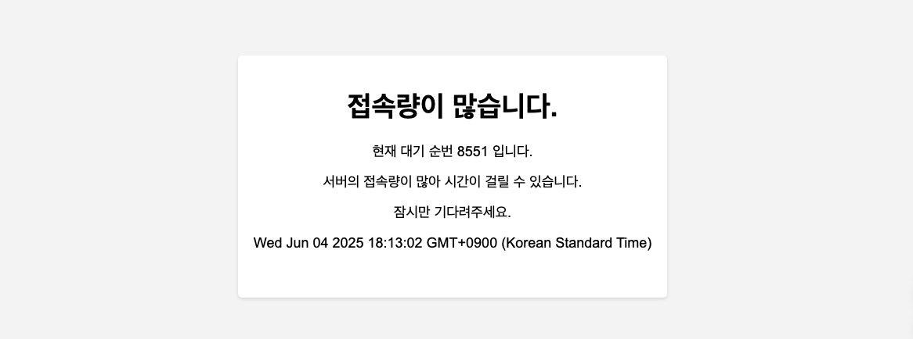
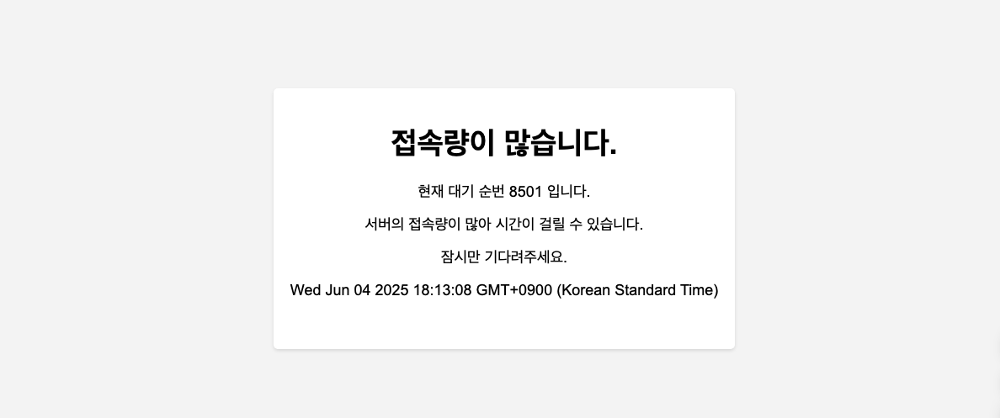
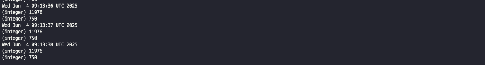

# 🎟️ TicketingSite  
대규모 트래픽을 고려한 티켓팅 접속자 대기열 시스템  

---

## 📌 사용 기술  
- Java 17  
- Spring Boot 3  
- Spring Data JPA  
- MySQL  
- Redis  

---

## 🏆 프로젝트 목적  
🖋️ 대규모 트래픽 상황에서도 안정적으로 처리 가능한 티켓팅 시스템 구현 1번째로 Reids와 RDB간의 속도 비교 2번째로 Spring Webflux를 활용한 접속자 대기열 시스템 구축

---

## 🛠️ 기능 설명  

1. **Spring MVC 기반**의 동기 방식 게시판 접속  
2. **Spring WebFlux 기반**의 비동기 게시판 접속  
   - Spring MVC → WebFlux 서버로 입장 요청 전달  
   - Redis의 Sorted Set(Queue) 사용  
     - Key: 유저 ID  
     - Value: 대기 시간  
   - WebFlux Scheduler를 통해 대기열 순서대로 입장 처리  

👉 동일한 게시판 구조를 기반으로 RDB vs Redis 성능 비교  

---

## 📣 성능 테스트 툴  
- Vegeta (오픈소스 부하 테스트 도구)

---

## 📝 테스트 시나리오  

- **Stress Test**  
- **Endurance Test**  
- **Peak Test**

---

## 📈 성능 비교: RDB vs Redis  

### 🕐 테스트 조건  
- 15초간  
- 초당 5000 요청  
- 100 워커 사용  

---

### ✅ 0. 기본 도커 자원 사용량  

---

### ❌ 1. RDB  

#### 부하 테스트 결과 (성공률 44.25%)  

#### MySQL 자원 사용량  

---

### ✅ 2. Redis  

#### 부하 테스트 결과 (성공률 100%)  

#### Redis 자원 사용량  

## 📌접속자 대기열 시스템

1. 선착순 페이지 이동 
2. 접속자 대기열 페이지 이동 (대기 토큰 발급 Redis sortedset 등록 시간순으로 랭크 등록) 
3. 스프링 스케줄러를 통해 Redis의 sortedset에서 특정수만큼 Pop을 하여 대기완료 sortedset저장
4. 선착순 페이지 이동시 토큰 체크후 대기완료에 없는경우 대기열로 리다이렉트 대기완료에 있는경우 선착순페이지 이동

### 🚒 선착순 페이지 이동

### 🏎 선착순 페이지에서 50명씩 빠지는 모습

### 🚐 Redis에 쌓이는 대기순서

