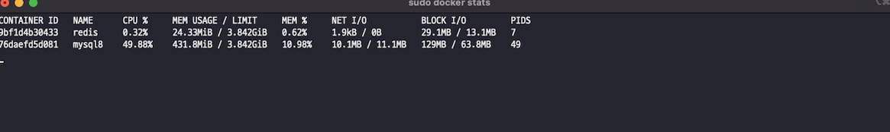
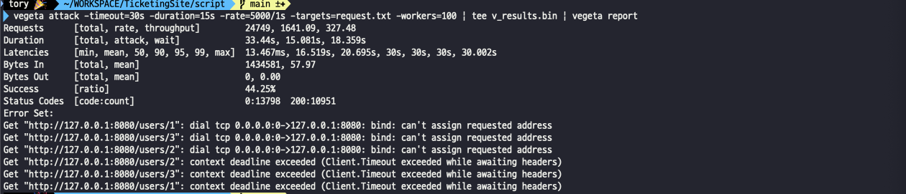
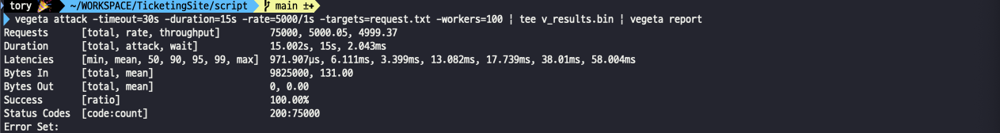
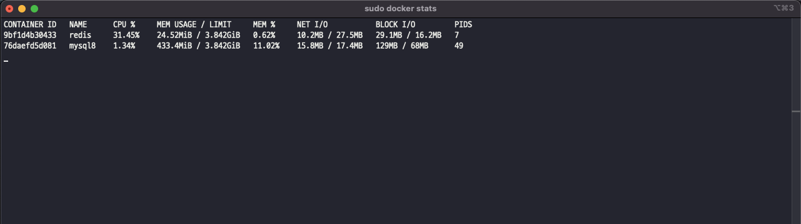

# TicketingSite
대규모 트래픽을 티켓팅 접속자 대기열 시스템

## 📌사용기술
JAVA 17, Spring Boot 3, Spring Data Jpa, MySQL, Redis

## 🏆 프로젝트 목적
🖋️대규모 트래픽을 고려한 티켓팅 접속자 대기열 시스템

## 🛠️기능 설명

1. Spring MVC 기반의 동기 방식의 게시판 접속
 
2. Spring WebFlux 기반의 비동기 방식의 게시판 접속 (Spring MVC에서 WebFlux기반 서버에 입장 요청)
Redis의 Queue(Sorted Set)의 Key는 유저 ID Value는 대기 시간 설정으로 선착순 입장을 보장한다.
또한 WebFlux의 Scheduler를 통해서 대기열의 유저를 선착순 입장하도록 도와준다.

같은 게시판구조에 대해 기본 RDB를 사용한 Spring MVC의 방식과 Redis를 사용한 WebFlux 방식의 비교

## 📣성능테스트 툴
Vegeta OpenSource

## 📝시나리오

STRESS 테스트, Endurance 테스트, PEAK 테스트

## 📈기본 성능 비교 RDB vs Redis
15초간 1초에 5000번 요청을 100워커로 부하를 주는 경우

## 0. 기본 도커 자원 사용량

## 1. RDB

### 부하 테스트 결과 (성공률 44.25%)

### Mysql 자원 사용량

## 2. Redis

### 부하 테스트 결과 (성공률 100%)

### Redis 자원 사용량
