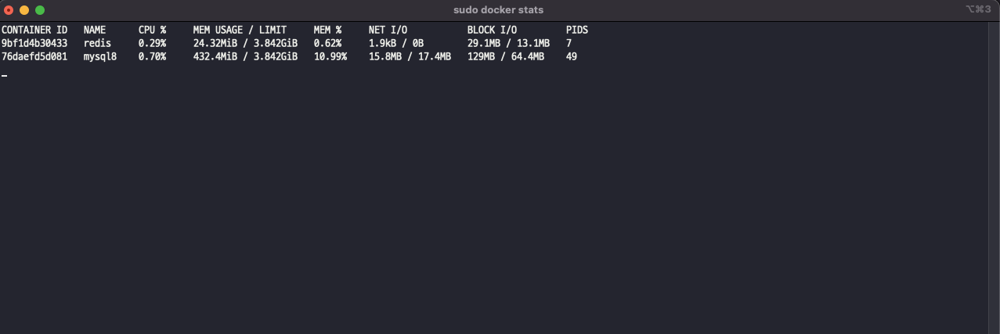

# 🎟️ TicketingSite  
대규모 트래픽을 고려한 티켓팅 접속자 대기열 시스템  

---

## 📌 사용 기술  
- Java 17  
- Spring Boot 3  
- Spring Data JPA  
- MySQL  
- Redis  

---

## 🏆 프로젝트 목적  
🖋️ 대규모 트래픽 상황에서도 안정적으로 처리 가능한 티켓팅 시스템 구현  

---

## 🛠️ 기능 설명  

1. **Spring MVC 기반**의 동기 방식 게시판 접속  
2. **Spring WebFlux 기반**의 비동기 게시판 접속  
   - Spring MVC → WebFlux 서버로 입장 요청 전달  
   - Redis의 Sorted Set(Queue) 사용  
     - Key: 유저 ID  
     - Value: 대기 시간  
   - WebFlux Scheduler를 통해 대기열 순서대로 입장 처리  

👉 동일한 게시판 구조를 기반으로 RDB vs Redis 성능 비교  

---

## 📣 성능 테스트 툴  
- Vegeta (오픈소스 부하 테스트 도구)

---

## 📝 테스트 시나리오  

- **Stress Test**  
- **Endurance Test**  
- **Peak Test**

---

## 📈 성능 비교: RDB vs Redis  

### 🕐 테스트 조건  
- 15초간  
- 초당 5000 요청  
- 100 워커 사용  

---

### ✅ 0. 기본 도커 자원 사용량  

---

### ❌ 1. RDB  

#### 부하 테스트 결과 (성공률 44.25%)  

#### MySQL 자원 사용량  

---

### ✅ 2. Redis  

#### 부하 테스트 결과 (성공률 100%)  

#### Redis 자원 사용량  

